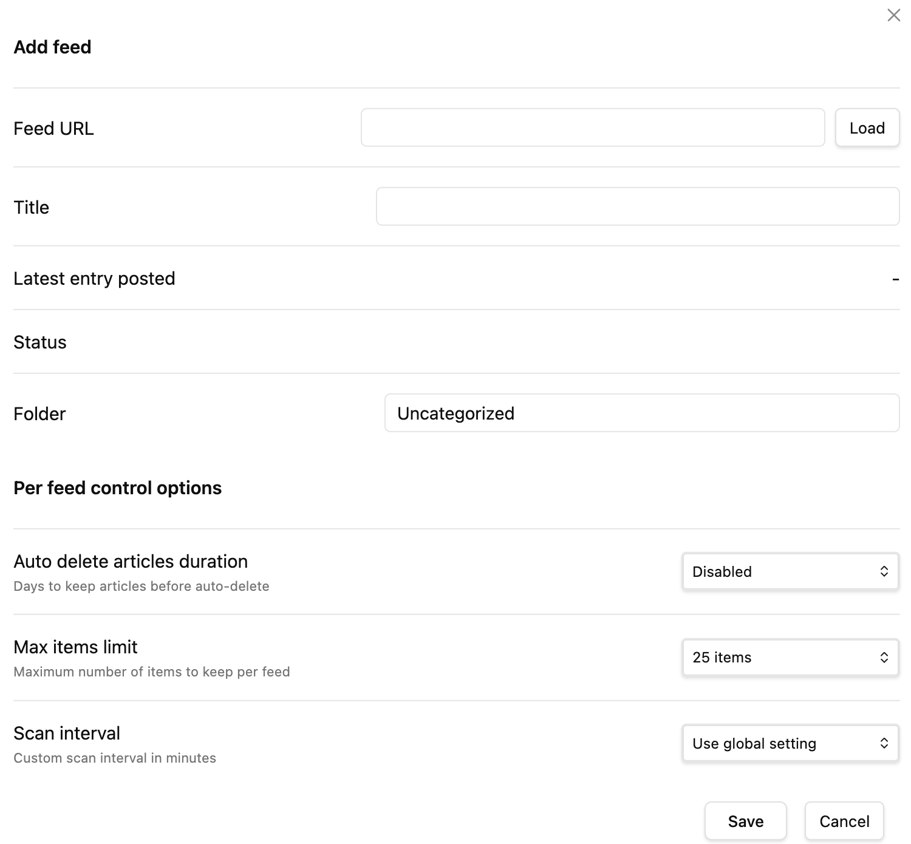
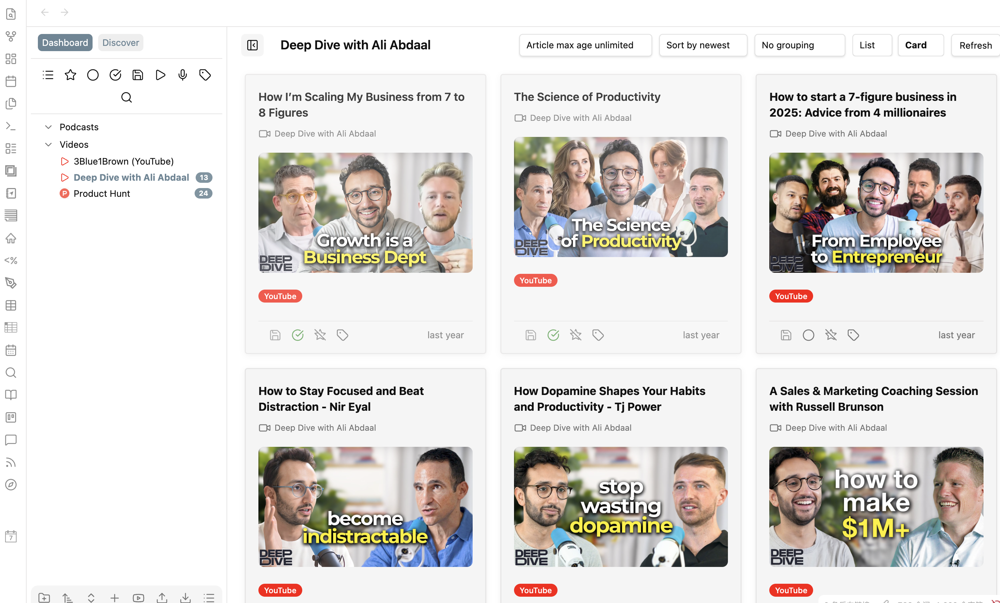

在不断探索适合自己的Obsidian系统的过程中，一直坚持信息输入、信息处理、信息整合、信息输出的基础结构，很多人可能觉得最重要的是输出，但是没有输入，哪里来的输出。因此，我一直在不断地优化自己的输入系统。

尝试过很多快速剪藏工具，浏览器收藏，或者人工输入信息等等各种方式，但用久之后会发现几个问题：

* 信息渠道太分散  
* 很难持续跟踪某个创作者  
* 信息来源不稳定  
* 很多优质内容会被算法淹没

尤其是一个很明显的问题：**我的信息来源太局限在国内。** 如果希望持续提升认知，其实需要接触更多 **全球视角的信息来源**。因此我开始重新梳理自己的信息输入需求。

进一步分析梳理当前的信息输入需求，由于经过近几年的不断优化，现在坚定的通过obsidian打造最基础的自己的个人系统，因此，希望可以聚焦如下几个方向的信息输入，然后再延伸整理和输出，当前信息输入需求渠道如下：

* Reddit
* Threads
* YouTube
* ... ...

因为，一直缺少海外渠道的信息输入，因此，希望可以建立一个全球视角的信息输入系统，然后发现可以满足此需求的插件是：RSS Dashboard。

通过此插件可以按照Feed URL关注不同渠道的博主，一旦有更新可以随时看到，然后进行后续的学习和打标，可以更好的进行信息输入，信息学习消化，然后打标按照自己的计划进行整理输出。

在使用RSS Dashboard以后发现，在Obsidian中进行定制化的订阅非常简单，一共分如下几个步骤：

1. 在插件市场下载RSS Dashboard
2. 通过打开你要的渠道如YouTube网页，右键打开源代码搜索channel_id=UChfo46ZNOV-vtehDc25A1Ug，复制对应的channel_id
3. 建立一个URL如：https://www.youtube.com/feeds/videos.xml?channel_id=UChfo46ZNOV-vtehDc25A1Ug
4. 然后点击RSS Dashboard，然后点击左侧导航的加号，打开Add Feed，在Feed URL中添加链接，然后填写Title标题，点击Load和Save即可。

在配置完成之后，如下图：

然后，当你开始逐个学习之后，可以进一步按照左侧导航栏已读和未读，或者按照需求进行打标签，都可以实现。

通过以上配置，建立了自己的信息输入系统之后，每天学习和记录之后，进行笔记整理，逐步可以建立一个全球最前沿信息选题库，同时也可以结合自己的兴趣如英语学习，关注自己喜欢的Podcast，建立自己的听力素材库。

很多人觉得知识管理是为了“存东西”。但在我看来更重要的是：**建立持续的信息输入能力。**

当输入足够稳定时：

- 选题会越来越多
- 观点会越来越清晰
- 输出也会越来越轻松

而 RSS Dashboard，其实就是我现在 **最核心的信息输入工具之一**。通过它，我正在慢慢建立一个：**属于自己的全球信息订阅系统。** 如果你也在使用 Obsidian，我非常建议你试试这个插件。因为当信息输入系统搭建好之后，很多事情都会变得简单很多。